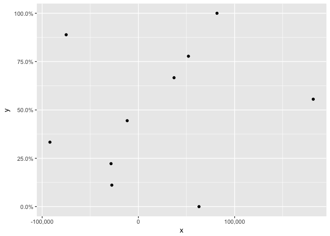
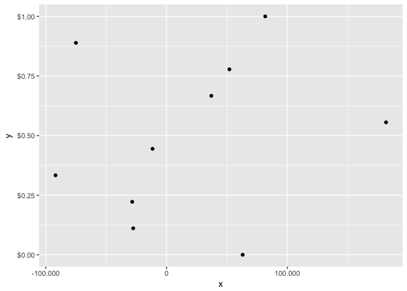
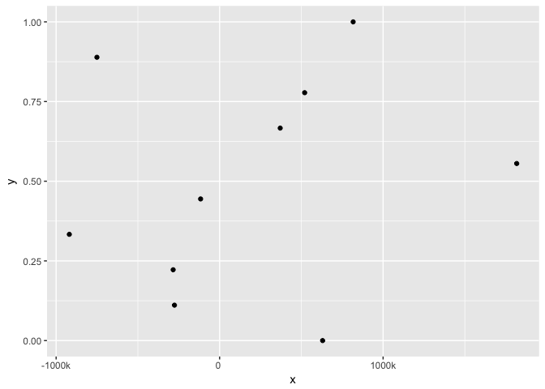

fivemat: Better formatting for R
================================

The **fivemat** package provides better formatting for R numbers. It has
similar functionality to the base R functions `sprintf`, `prettyNum` and
`formatC`, but with more features and support for locales.

This package is primarily a port of the Javascript library
[d3-format](https://github.com/d3/d3-format/blob/master/README.md).

Installation
------------

**fivemat** is not on CRAN, you can install the development version from
github with

    # install.packages("devtools")
    devtools::install_github("jrnold/fivemat")

Usage
-----

The `fmt` function is the primary function in the package. The
formatting is defined using a mini-language similar to `sprintf`.

### Formats

Some examples include: A rounded percentage,

    fmt(c(0.1, 0.12, 0.123, 0.1234), ".0%")

    ## [1] "10%" "12%" "12%" "12%"

    fmt(c(0.1, 0.12, 0.123, 0.1234), ".1%")

    ## [1] "10.0%" "12.0%" "12.3%" "12.3%"

a localized fixed-point currency,

    fmt(-3.5, "($.2f", locale = "en-GB")

    ## [1] "(£3.50)"

    fmt(-3.5, "($.2f", locale = "en-US")

    ## [1] "($3.50)"

a space-filled and signed number,

    fmt(42, "+20")

    ## [1] "                 +42"

a dot-filled and centered number,

    fmt(42, ".^20")

    ## [1] ".........42........."

SI-prefixed numbers with two significant digits,

    fmt(1.23 * 10 ^ seq(-24, 24, by = 1), ",.2s")

    ##  [1] "1.2y"   "12y"    "1,200y" "1.2z"   "12z"    "1,200z" "1.2a"  
    ##  [8] "12a"    "1,200a" "1.2f"   "12f"    "1,200f" "1.2p"   "12p"   
    ## [15] "1,200p" "1.2n"   "12n"    "1,200n" "1.2μ"   "12μ"    "1,200μ"
    ## [22] "1.2m"   "12m"    "1,200m" "1.2 "   "12 "    "1,200 " "1.2k"  
    ## [29] "12k"    "1,200k" "1.2M"   "12M"    "1,200M" "1.2G"   "12G"   
    ## [36] "1,200G" "1.2T"   "12T"    "1,200T" "1.2P"   "12P"    "1,200P"
    ## [43] "1.2E"   "12E"    "1,200E" "1.2Z"   "12Z"    "1,200Z" "1.2Y"

SI-prefixed numbers with one digit after the decimal point and a common
SI-prefix,

    fmt(1.23 * 10 ^ seq(-24, 24, by = 1), ".1", si = 1e3)

    ##  [1] "0.0k"                      "0.0k"                     
    ##  [3] "0.0k"                      "0.0k"                     
    ##  [5] "0.0k"                      "0.0k"                     
    ##  [7] "0.0k"                      "0.0k"                     
    ##  [9] "0.0k"                      "0.0k"                     
    ## [11] "0.0k"                      "0.0k"                     
    ## [13] "0.0k"                      "0.0k"                     
    ## [15] "0.0k"                      "0.0k"                     
    ## [17] "0.0k"                      "0.0k"                     
    ## [19] "0.0k"                      "0.0k"                     
    ## [21] "0.0k"                      "0.0k"                     
    ## [23] "0.0k"                      "0.0k"                     
    ## [25] "0.0k"                      "0.0k"                     
    ## [27] "0.1k"                      "1.2k"                     
    ## [29] "12.3k"                     "123.0k"                   
    ## [31] "1230.0k"                   "12300.0k"                 
    ## [33] "123000.0k"                 "1230000.0k"               
    ## [35] "12300000.0k"               "123000000.0k"             
    ## [37] "1230000000.0k"             "12300000000.0k"           
    ## [39] "123000000000.0k"           "1230000000000.0k"         
    ## [41] "12300000000000.0k"         "123000000000000.0k"       
    ## [43] "1230000000000000.0k"       "12300000000000000.0k"     
    ## [45] "123000000000000000.0k"     "1230000000000000000.0k"   
    ## [47] "12300000000000000000.0k"   "122999999999999983616.0k" 
    ## [49] "1230000000000000000000.0k"

a prefixed lowercase hexadecimal number,

    fmt(48879, "#x")

    ## [1] "0xbeef"

a number grouped by thousands with two-significant digits,

    fmt(4223, ",.2r")

    ## [1] "4,200"

### Localization

The `locale` argument supports localization of groupings, decimal marks,
numerals,

    x <- 12345678910.12
    fmt(x, "$,.2f", locale = "en-US")

    ## [1] "$12,345,678,910.12"

    fmt(x, "$,.2f", locale = "en-GB")

    ## [1] "£12,345,678,910.12"

    fmt(x, "$,.2f", locale = "en-IN")

    ## [1] "\u20b912,34,56,78,910.12"

    fmt(x, "$,.2f", locale = "fr-FR")

    ## [1] "12.345.678.910,12 €"

    fmt(x, "$,.2f", locale = "ar-SA")

    ## [1] "١٢٬٣٤٥٬٦٧٨٬٩١٠٫١٢ ر.س."

    fmt(x, "$,.2f", locale = "zh-CN")

    ## [1] "¥12,345,678,910.12"

    fmt(x, "$,.2f", locale = "ja-JP")

    ## [1] "12,345,678,910.12円"

The available default locales are in the `fmt_locales`. The default
locales are those provided by the
[d3-format](https://github.com/d3/d3-format) Javascript library.

### Formatters and Scales

Formats can be saved as a function to be reused,

    formatter <- fmt_new(",.2f")
    formatter(c(1, 100, 1000, 1050, 1.50))

    ## [1] "1.00"     "100.00"   "1,000.00" "1,050.00" "1.50"

    formatter(rnorm(5))

    ## [1] "0.59"  "0.71"  "-0.11" "-0.45" "0.61"

This makes it easy to use as a formatter with `ggplot2` scales:

    library("ggplot2")

    ## Need help? Try the ggplot2 mailing list:
    ## http://groups.google.com/group/ggplot2.

    df <- data.frame(
      x = rnorm(10) * 100000,
      y = seq(0, 1, length.out = 10)
    )
    p <- ggplot(df, aes(x, y)) + geom_point()
    p + scale_y_continuous(labels = fmt_new(".1%")) +
      scale_x_continuous(labels = fmt_new(","))

    p + scale_y_continuous(labels = fmt_new("$.2f")) +
      scale_x_continuous(labels = fmt_new(",", "fr-FR"))

    p + scale_y_continuous(labels = fmt_new(".2f")) +
      scale_x_continuous(labels = fmt_new(".0s"))

### SI Prefixes

The `si` argument can be used to apply a common SI-prefix to all the
values.

    fmt(c(0.00042, 0.0042), spec = ",.0", si_prefix = 1e-6)

    ## [1] "420μ"   "4,200μ"
